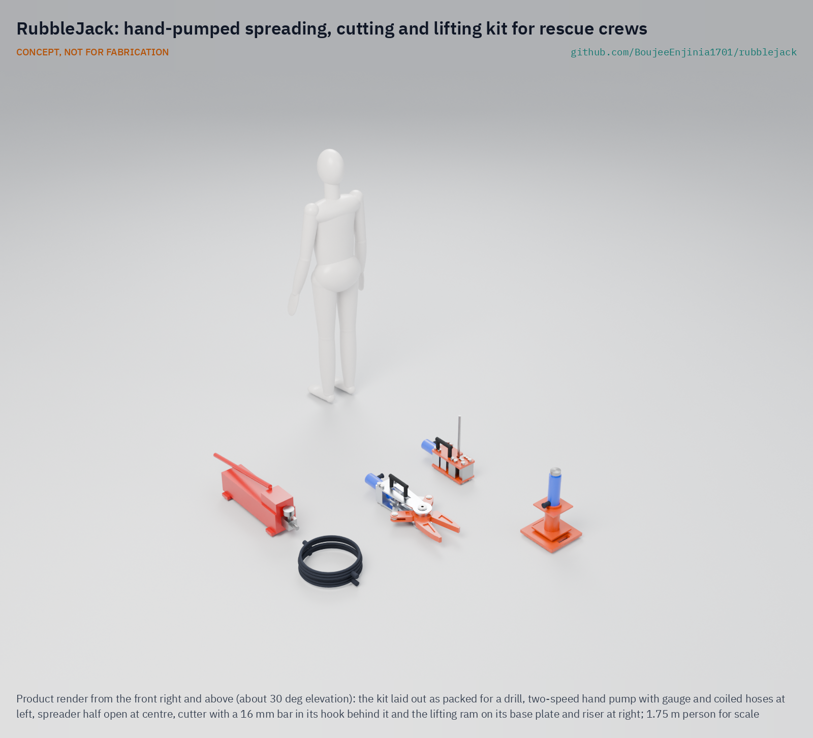

# RubbleJack

     

**Area:** Situational field hardware · **TRL:** 3 of 9 (proof of concept on paper) · **Value-engineering target:** about $3,500 USD (estimated cost of the constructable design about $5,895 USD) · **Difficulty:** 4 of 5

Turns commodity construction hydraulics into an open spreading, lifting and cutting kit for crews without powered rescue tools.

[Exploded render](media/render-exploded.png) · [Detail render](media/render-detail.png) · [Interactive 3D model](media/viewer.html) · [Concept blueprint (PDF)](media/concept-blueprint.pdf) · [General arrangement (PDF)](cad/drawings/RBJ-DWG-001.pdf) · [Calculations](docs/04-calcs/01-sizing.md) · [Prototype build plan](docs/05-build-plan.md) · [Design decisions](docs/06-design-decisions.md) · [Review note](docs/REVIEW.md)

> **Not certified rescue equipment.** RubbleJack is a TRL 3 concept, not released for fabrication, and not certified to NFPA 1936, NFPA 1960 or EN 13204. See [Safety](#safety).

## Concept rationale

The tools that lift, spread and cut are hydraulic, and the hydraulic parts are the same ones construction and body shops use every day: hand pumps, hoses, rams and standard cylinders. RubbleJack packages commodity construction hydraulics into an open rescue kit: a hand pump, hoses, a lifting ram, and spreader and cutter jaws built onto standard cylinders. A volunteer crew carries it to a collapse and pumps by hand to spread, lift and cut debris off trapped people.

Keeping it open and commodity-based matters because the crews who reach people first are the least equipped. Branded rescue sets are certified and expensive; commodity parts are sold in every town and can be replaced locally. Publishing the jaws, the proof-load data and the limits openly lets crews build, test and repair the kit, and lets them know exactly what it is and is not rated for.

## Burning platform

A review of international search and rescue deployments found that most people rescued after earthquakes are rescued locally, often by relatives and neighbours ([Rom and Kelman, 2020](https://pmc.ncbi.nlm.nih.gov/articles/PMC7745699/)). After the February 2023 earthquake in Turkey, residents dug by hand; in Antakya a woman trying to reach her mother said that if only they could lift the concrete slab they would be able to reach her ([Euronews, 2023](https://www.euronews.com/2023/02/07/we-could-hear-their-voices-digging-with-bare-hands-for-earthquake-survivors)). After the March 2025 earthquake in Myanmar, rescuers in Mandalay said the lack of proper equipment left people trapped and borrowed machinery from private businesses ([Al Jazeera, 2025](https://www.aljazeera.com/news/2025/3/29/lack-of-equipment-stalls-race-to-save-earthquake-survivors-in-myanmar)).

Cost keeps powered tools away from small crews. In Texas, a rural volunteer fire department needed a USD 14,900 state grant to buy three rescue tools ([Texas A&M Forest Service, 2017](https://tfsweb.tamu.edu/?p=12405)). A single battery spreader weighs about 19.5 kg ([Holmatro](https://www.holmatro.com/en/rescue/spreader-psp40)), and even a used hand-pump spreader and cutter sold as a demonstrator for USD 2,595 against a list price of USD 4,988 ([Fenton Fire](https://www.fentonfire.com/equipment/holmatro-hct-3120-hand-pump-spreader-cutter-a1758/)).

## Where it could be used

### By industry

| Industry | Use |
| --- | --- |
| Volunteer and rural fire services | Low-cost spreading, lifting and cutting for collapses and vehicle incidents |
| Community disaster response teams | Neighbourhood kit for the first hours after an earthquake |
| Humanitarian and disaster NGOs | Prepositioned kits and training in earthquake-prone regions |
| Construction and demolition | Freeing workers trapped by collapsed formwork or masonry |
| Mining and quarrying | Lifting and spreading after small rock and structure falls |

### By country or region

| Country or region | Why it matters there |
| --- | --- |
| Turkey | After the 2023 earthquake, families dug with their hands and could not lift slabs to reach trapped relatives ([Euronews, 2023](https://www.euronews.com/2023/02/07/we-could-hear-their-voices-digging-with-bare-hands-for-earthquake-survivors)). |
| Myanmar | Rescue teams in Mandalay reported a lack of proper equipment after the March 2025 earthquake ([Al Jazeera, 2025](https://www.aljazeera.com/news/2025/3/29/lack-of-equipment-stalls-race-to-save-earthquake-survivors-in-myanmar)). |
| United States (rural) | A rural Texas volunteer department relied on a USD 14,900 grant for three rescue tools ([Texas A&M Forest Service, 2017](https://tfsweb.tamu.edu/?p=12405)). |
| Global (earthquake regions) | Most people rescued after earthquakes are rescued locally by relatives and neighbours, not by international teams ([Rom and Kelman, 2020](https://pmc.ncbi.nlm.nih.gov/articles/PMC7745699/)). |

## What sparked the idea

The idea came from reporting after the February 2023 earthquake in Turkey. In Nurdag, a resident said they could hear trapped people's voices calling for help, and in Antakya a woman searching for her elderly mother said that if only they could lift the concrete slab they would be able to reach her ([Euronews, 2023](https://www.euronews.com/2023/02/07/we-could-hear-their-voices-digging-with-bare-hands-for-earthquake-survivors)). The people on the spot had the will and the numbers. What they lacked was a way to move a slab. The hydraulics that can move it are sold in every hardware and body shop.

## Problem

After a building collapse, most trapped people are reached by neighbours and local crews long before specialist teams arrive, but those crews usually have no way to lift, spread or cut concrete. Powered rescue tools cost more than many volunteer departments can pay.

Full problem statement: [docs/01-problem.md](docs/01-problem.md)

## Concept

A rescue kit built from commodity construction hydraulics that a volunteer crew carries to a collapse and pumps by hand to spread, lift and cut debris off trapped people. One two-speed 700 bar hand pump drives three tools, each on its own bought 15 t cylinder, so a tool change is one hose coupler swap:

- **Spreader:** two steel jaw arms on one pin, opened by a crosshead and two links; 49 to 64 kN between the tips, 262 mm opening.
- **Cutter:** a guillotine shear with hardened blades and a hook for the bar; shears 16 mm reinforcing bar, which needs about 105 kN of the cylinder's 142 kN.
- **Lifting ram:** 14.5 t on a 250 mm base plate, 527 mm reach with its riser, always on hardwood cribbing.

The kit packs into four loads of 15.9, 24.8, 22.0 and 23.7 kg. All figures are paper estimates at 700 bar from the calculation note.

Full design precis: [docs/02-concept.md](docs/02-concept.md) · Requirements: [docs/03-requirements.md](docs/03-requirements.md)

## Key components

- Two-speed hand pump, 700 bar, with gauge
- Two 2 m hoses with quick couplers
- Three single-acting 15 t cylinders, one per tool
- Spreader: collar adapter, aluminium frame plates, crosshead, links, two 4340 steel jaw arms, pins
- Cutter: collar adapter, steel plates with a hook, blade carrier, hardened moving and fixed blades, nose block, stop bar
- Lifting ram: high-strength steel base plate, riser block, tilting saddle
- Four carry bags

## Building the prototype

The [prototype build plan](docs/05-build-plan.md) shows how to make each of the eighteen made parts, with a making sketch for each, nine joint close-ups and sixteen assembly steps. The parts are waterjet or laser cut from plate, machined, and for the arms, pins and blades heat treated; the hydraulics are bought. Every tool is proof-loaded on CalRig and crack-checked before any use; the plan is a plan, not yet built.

## Safety

> Safety-critical: involves lifting, spreading and cutting with hydraulics at 700 bar and forces of 142 kN. Published as an open engineering reference, never as certified rescue equipment. Not for fabrication: this is a TRL 3 concept on paper.
>
> Hydraulic oil at high pressure can pierce skin; never feel for leaks by hand, and replace damaged hoses at once.
>
> Never work under a load held only by a ram. Crib the load as it rises and keep cribbing close. The ram's base plate always goes on hardwood sleepers, never on bare rubble, and the riser goes under the cylinder, never on the plunger.
>
> Collapsed structures can shift in aftershocks; use trained people and follow local incident command.
>
> Stay within the rated pressure shown on every part; the weakest part sets the limit.
>
> Wear eye and face protection when cutting or spreading; cut ends and fragments can fly. Cut only reinforcing bar of 16 mm or less.
>
> Every made tool must be proof-loaded and crack-checked before any use.
>
> This design is published as an open engineering reference. It is not certified equipment.

## Repository layout

| Folder | Contents |
| --- | --- |
| `docs/` | Problem, concept, requirements, calculations, build plan and design decisions |
| `cad/src/` | build123d Python source, the source of truth for all geometry |
| `cad/step/`, `cad/stl/` | Exported models for FreeCAD, other CAD tools and printing |
| `cad/drawings/` | 2D sketches and dimensioned drawings |
| `bom/` | Bill of materials |
| `electronics/` | KiCad schematics and PCB layouts |
| `firmware/` | Microcontroller code |
| `media/` | Renders, perspectives and photos |
| `build-log/` | Dated prototyping notes |

## Documentation

Controlled documents follow the portfolio [documentation standard](.kit/STANDARDS.md). Each carries a document ID (RBJ-PRC-001 for the precis), a version and a revision history. Branded PDFs are built with `python .kit/render.py` and attached to GitHub Releases when a document is tagged, for example `RBJ-PRC-001/v1.0`.

## Credits

Designed by Amish Chadha at Design Molecule Labs. See [CONTRIBUTORS.md](CONTRIBUTORS.md) for roles. To cite this design, use [CITATION.cff](CITATION.cff) (GitHub shows it as "Cite this repository").

AI assistance (Claude) was used to accelerate prototype documentation and first-pass research. Design direction and all decisions are Amish Chadha's, recorded in this repository's decision records (`docs/decisions/`).

## Licenses

- **Hardware** (CAD, drawings, BOM, electronics): [CERN-OHL-S v2](LICENSE)
- **Software** (firmware, scripts, notebooks): [MIT](LICENSE-SOFTWARE)

A project of the [Design Molecule](https://designmolecule.com) lab.
