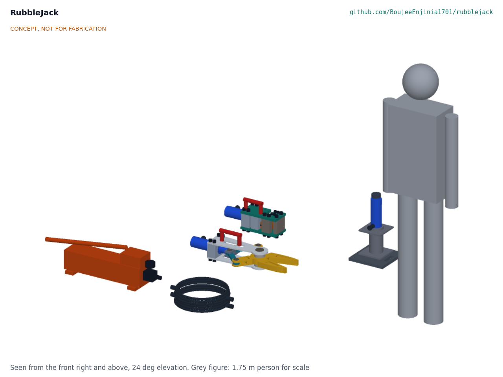
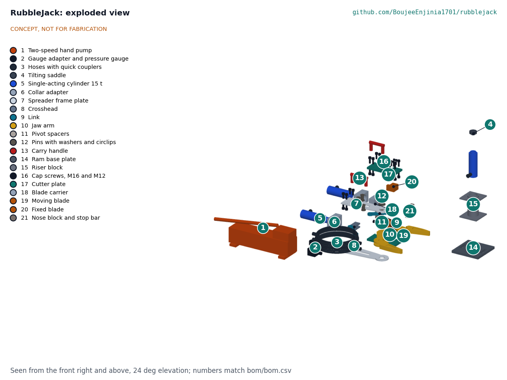
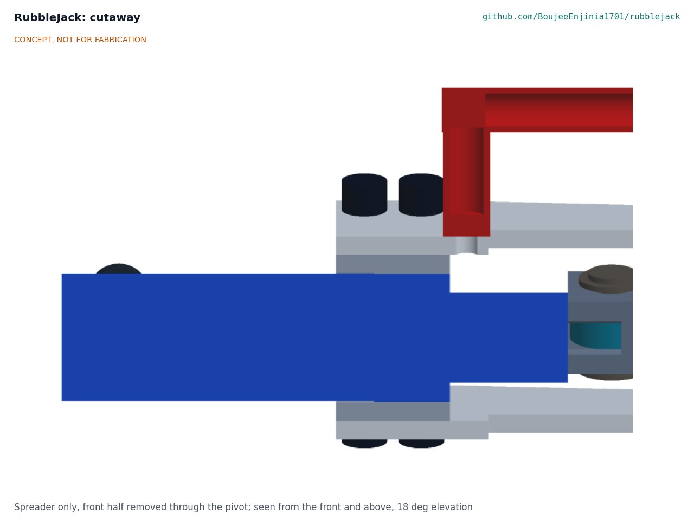
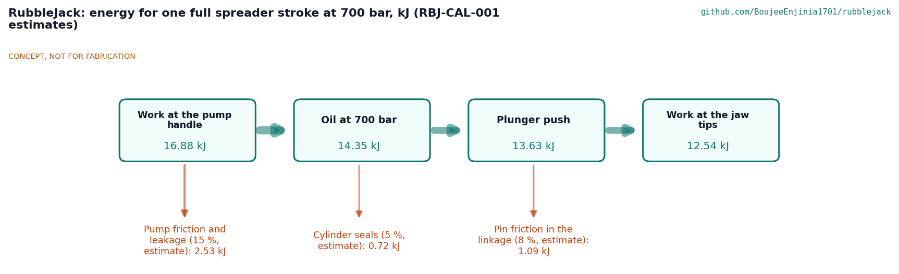
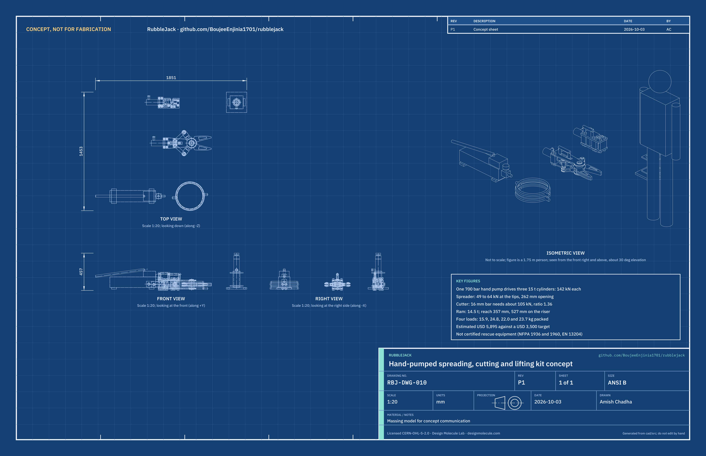

# RubbleJack design precis

Turns commodity construction hydraulics into an open spreading, lifting and cutting kit for crews without powered rescue tools.

*Figure 1. The kit as packed for a drill: hand pump with gauge and hoses, spreader, cutter and lifting ram set. CONCEPT, NOT FOR FABRICATION.*

> **Safety:** RubbleJack is safety-critical. It lifts and spreads loads of up to 142 kN (14.5 t) with oil at 700 bar (10,000 psi), in collapsed structures that can move. It is published as an open engineering reference, never as certified rescue equipment, and it is not certified to NFPA 1936, NFPA 1960 or EN 13204. See the Safety section below before reading further.

## How it works

One person works a two-speed hand pump; a 2 m hose with quick couplers carries oil at up to 700 bar to whichever tool is connected. Each of the three tools has its own bought 15 t, 101 mm stroke single-acting cylinder, so changing tools means only uncoupling one hose and coupling another (RBJ-DDR-001, D2):

- **Spreader.** The cylinder pushes a crosshead forward; two links push the tails of two jaw arms that turn on one pivot pin, so the jaw tips open from 32 mm to 262 mm with 49 to 64 kN between them. The arms are held between two aluminium frame plates that bolt to a collar adapter screwed onto the cylinder's collar thread.
- **Cutter.** The cylinder pushes a moving blade past a fixed blade, like a guillotine. The bar lies in a hook cut in two steel plates and in a U notch in each blade; the 142 kN of the cylinder shears 16 mm reinforcing bar, which needs about 105 kN. A stop bar ends the stroke after the cut.
- **Lifting ram.** The third cylinder stands in a ring on a 250 mm steel base plate, with a tilting saddle on its plunger. A 150 mm riser block can go under it, never on top of the plunger, for 527 mm of reach. The crew cribs the load with hardwood as it rises.

The gauge on the pump outlet shows the working pressure; the pump's internal relief valve stops at 700 bar. The cylinders retract by their own springs when the pump's release valve is opened, so the spreader and cutter have no powered closing force.

*Figure 2. Exploded view; numbers match the BOM lines in Table 1.*

## Components

*Table 1. Main components (numbers match bom/bom.csv and Figure 2).*

| # | Component | Role | Made or bought |
| --- | --- | --- | --- |
| 1 | Two-speed hand pump, 700 bar | Powers every tool; fast stage at low load, slow stage at high pressure | Bought |
| 2 | Gauge adapter and gauge | Shows working pressure on the pump outlet | Bought |
| 3 | Hoses, 2 m, with quick couplers | Connect the pump to any tool without tools | Bought |
| 4 | Tilting saddle | Spreads the ram's push on an uneven load | Bought |
| 5 | Single-acting cylinder, 15 t (three) | One per tool | Bought |
| 6 | Collar adapter (two) | Joins a tool's frame plates to its cylinder's collar thread | Made, 7075-T6 |
| 7 | Spreader frame plates (two) | Carry the pivot pin and the reaction back to the adapter | Made, 7075-T6 10 mm |
| 8 | Crosshead | Turns the plunger's push into two link pushes | Made, 7075-T6 |
| 9 | Links (two) | Push the jaw arm tails | Made, S690QL |
| 10 | Jaw arms (two) | Spread the load at the tips | Made, 4340 quenched and tempered |
| 11 | Pivot spacers (two) | Fill the gap between arms and plates | Made, 7075-T6 |
| 12 | Pins | Main pivot pin and four link pins | Made, 4340 quenched and tempered |
| 13 | Carry handles (two) | One on the spreader, one on the cutter | Made, steel tube |
| 14 | Ram base plate | Spreads the ram's load on cribbing | Made, S690QL 20 mm |
| 15 | Riser block | Extends the ram's reach by 170 mm | Made, S355 tube and plate |
| 16, 24 | Cap screws, M16 and M12 | Hold every bolted joint | Bought |
| 17 | Cutter plates (two) | Hold the blades, nose and stop; the hook takes the bar | Made, S690QL 16 mm |
| 18 | Blade carrier | Carries the moving blade on the plunger | Made, 7075-T6 |
| 19, 20 | Moving and fixed blades | Shear the bar | Made, S7 tool steel, hardened |
| 21 | Nose block and stop bar | Take the fixed blade's thrust; end the cutter stroke | Made, 7075-T6 and S355 |
| 22 | M24 studs | Hold the crosshead and carrier on their plungers | Bought |
| 23 | Carry bags (four) | One bag a load | Bought |

*Figure 3. Cutaway of the spreader, front half removed: frame plates, spacers, interleaved jaw arm knuckles and the main pin.*

## Key design choices

All are decided under Amish's 2026-10-03 pre-approval and recorded in RBJ-DDR-001 and RBJ-DDR-002; the register is RBJ-DEC-001.

- **Commodity 700 bar hydraulics** (D1): the most widely stocked hand hydraulic class; at least two makers offer every bought part.
- **One cylinder per tool** (D2): a tool change is a coupler swap of about 20 s, at the cost of two extra cylinders.
- **Linkage spreader and guillotine cutter** (D3, D4): pinned plate parts a local workshop can make; the cutter is rated for 16 mm bar only.
- **Located ram stack** (D5): base ring, riser spigot and saddle, so nothing stacked can slide; never a riser on the plunger.
- **Strength rule** (D7): every made load-bearing part at least 1.5 on yield at 700 bar; the lowest is the jaw arm tail at the link slot, 1.60.
- **Four loads under 25 kg** (D10): high-strength steel where sections are small and 7075-T6 aluminium where parts are bulky.

## First-order numbers

All at the pump's 700 bar relief pressure, from RBJ-CAL-001; first-principles paper estimates, nothing measured.

*Table 2. Key figures.*

| Quantity | Value | Assumption |
| --- | --- | --- |
| Force per cylinder | 142 kN (14.5 t) | 20.3 cm² effective area at 700 bar |
| Spreading force at the tips | 49 kN closed to 64 kN fully open | Pin friction ignored; linkage geometry from the model |
| Tip opening | 32 mm closed, 262 mm open | 101 mm stroke |
| Force to shear 16 mm bar | About 105 kN; ratio 1.36 to the cylinder | Shear strength 0.8 of a 650 MPa tensile strength (upper bound for B500B and A615 grade 60) |
| Ram reach | 256 mm closed, 357 mm open, 527 mm on the riser | Saddle included |
| Pump strokes, full stroke under load | About 228 slow-stage strokes, 9 min | 0.9 cm³ a stroke, 25 strokes a minute (estimate) |
| Pump strokes, one cut | About 41, under 2 min | 37 cm³ to close the cut (estimate) |
| Loads, packed | Pump set 15.9 kg, spreader 24.8 kg, cutter 22.0 kg, ram set 23.7 kg | 0.8 kg bag each |
| Lowest strength margin | 1.60 (jaw arm tail) | Minimum yield values; conservative hand calculations |
| Cost | Value-engineering target: USD 3,500. Estimated cost of the constructable design: USD 5,895 (USD 2,395 over the target) | Indicative prices in bom/bom.csv |

*Figure 4. Energy for one full spreader stroke at 700 bar, from the pump handle to the jaw tips. All efficiencies are estimates.*

*Figure 5. Concept blueprint RBJ-DWG-010 with orthographic views and key figures.*

## Patent design-arounds

From the preliminary patent, trademark and prior-art screen (not legal advice), kept as scaffolded:

- Use a commodity pump only, not a compact integrated pump unit (US11273547, Weber). RubbleJack uses a separate catalogue hand pump and hoses.
- Avoid features of the Holmatro portfolio, including the CC 23 crusher and its hand pumps. RubbleJack has no crusher and no integrated pump.
- Publish proof-load data and a clear not-certified notice naming NFPA 1936, NFPA 1960 and EN 13204 (RBJ-DDR-001, D8).
- Interchangeable tools on one hydraulic supply draw on lapsed prior art (US7937838B2); RubbleJack goes further and gives each tool its own cylinder.

## Shared blocks

- Commodity hydraulics block: pump, hoses, couplers and gauge (adopted, RBJ-DDR-001, D13).
- CalRig: proof testing of the jaws, blades, ram stack and hoses at TRL 4.
- VoidScope: sibling project for searching the voids RubbleJack opens.

## Safety

> **Safety:** RubbleJack involves lifting, spreading and cutting with high-pressure hydraulics in unstable structures. It is not certified rescue equipment and must not be used on a real rescue on the strength of this document.

- **High-pressure oil.** Oil at 700 bar can pierce skin and cause injuries that need surgery. Never feel for leaks by hand; use card. Replace a damaged, kinked or abraded hose at once. Keep the gauge fitted; stop below 700 bar.
- **Lifting.** Never work under a load held only by a ram. Crib the load with hardwood as it rises and keep the cribbing within 25 mm of the load. Never lift on bare rubble; the base plate goes on hardwood sleepers. Never put the riser on top of the plunger.
- **Spreading and cutting.** Keep hands and bodies out of the jaws, the cutter hook and the line of any bar end. Cut bar ends and broken masonry can fly: eye and face protection for everyone near the tool. Cut only reinforcing bar of 16 mm or less, never hardened bar, chain, cable or springs.
- **Stored energy.** A spreading load or a bent bar holds energy; release the pump's valve slowly and stand clear of the line a load could move.
- **Structures.** Collapsed structures move in aftershocks. Use trained people, follow local incident command and shore before entering.
- **Weakest part.** Every part is rated for 700 bar; the pump's relief valve is the limit. Never fit a part rated below 700 bar. Each made tool is proof-loaded on CalRig and inspected for cracks before use (RBJ-DDR-001, D9).

## Open questions

None. The questions from the scaffold were settled at the TRL 2 review (RBJ-DDR-001) and in the calculations (RBJ-CAL-001); facts that need real parts are listed in the design decisions register (RBJ-DEC-001) under "To confirm when parts are bought".
